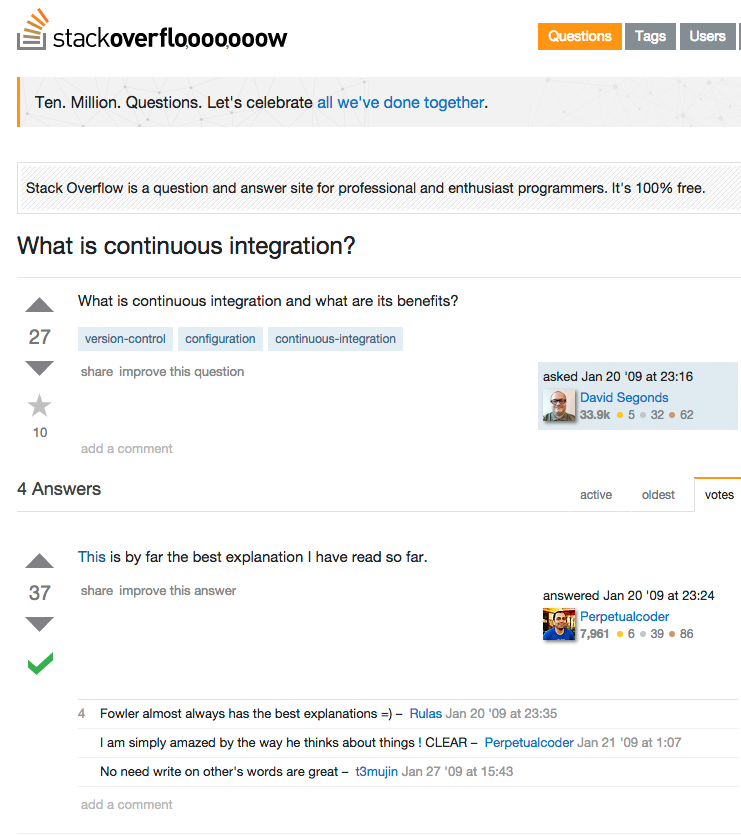

```{r setup, include=FALSE}
knitr::opts_chunk$set(echo = FALSE)
```

## What this talk is

> - Part instructional
> - Part wishlist and work-in-progress

# The whats and whys of CI

## The what {.smaller}

<center></center>

[http://stackoverflow.com/q/463511](http://stackoverflow.com/q/463511)

## 8000 (excellent, general, somewhat dated) words of explanation

[http://martinfowler.com/articles/continuousIntegration.html](http://martinfowler.com/articles/continuousIntegration.html)

## What is CI for R/BioC packages?

> Automated and regular running of `R CMD build` and `R CMD check` when you make changes to your R package

- __TODO: Note that these mostly test on a flavour of linux (and use VMs)__

## The why

My initial reasons:

> - All the cool kids do it
> - It beat writing my PhD

Real reasons:

> - __TODO__

## CI vs. other/existing options

__TODO: Compare__

- win-builder
- BioC build machines

## Version control

<div class="columns-2">

### Options

- [https://github.com/](https://github.com/)
- [https://bitbucket.org/](https://bitbucket.org/)
- [https://about.gitlab.com/](https://about.gitlab.com/)
- Several others [e.g., for non-Git-based respositories]
  
  > "... I think Git + GitHub is the most user-friendly system (especially for new developers), not least because its popularity means that the answer or solution to every possible question or problem can be found on StackOverflow" [[Hadley Wickham](http://r-pkgs.had.co.nz/git.html)]

</div>

# What follows assumes you use GitHub

# Don't worry, options exist if you don't

## Continuous Integration

<div class="columns-2">

### Options

- [https://travis-ci.org](https://travis-ci.org)
- [https://jenkins-ci.org/](https://jenkins-ci.org/)
- [https://codeship.com/](https://codeship.com/)
- [https://circleci.com/](https://circleci.com/)
- [https://semaphoreci.com/](https://semaphoreci.com/)
- [https://drone.io/](https://drone.io/)
- [http://www.appveyor.com/](http://www.appveyor.com/)
- [http://wercker.com/](http://wercker.com/)
    - [(Currently unaddressed) concerns about permissions required by _wercker_](https://github.com/wercker/support/issues/20)
- [https://en.wikipedia.org/wiki/Comparison_of_continuous_integration_software](https://en.wikipedia.org/wiki/Comparison_of_continuous_integration_software)

### Considerations

> - Operating systems supported
> - Native R support
> - Code coverage support (via [https://github.com/jimhester/covr](https://github.com/jimhester/covr))

</div>

# Travis

## Travis

<div class="columns-2">

### Pros

- Only CI with native R support
    - But still incomplete ...
- Supports both Linux and OS X
- Biggest R community
- Simple integration with code coverage services via [https://github.com/jimhester/covr](https://github.com/jimhester/covr)

### Cons

- No Windows support
    - Might try [http://www.appveyor.com/](http://www.appveyor.com/) and [https://github.com/krlmlr/r-appveyor/](https://github.com/krlmlr/r-appveyor/)

</div>

# R + CI

# R + ~~CI~~ Travis

## A word of warning

- CI + R are a moving target
- Even more so once you throw BioC into the mix

## Basics

1. Ensure your package is on GitHub[^github]
2. Create a `.travis.yml` file in top-level of package directory
     - Can use `devtools::use_travis()`
3. Go to [https://travis-ci.org](https://travis-ci.org) and flick the switch on the repo you want to test
     - __TODO: Image__
4. Commit and push to GitHub.
5. Wait a few minutes for email notification of result (or follow the action [live](https://travis-ci.org/PeteHaitch/GenomicTuples) at [https://travis-ci.org](https://travis-ci.org))

[^github]: Or similar (with appropriate changes)

# `.travis.yml`

## Minimalist

```yml
language: r
sudo: required # See docs for details
```

Will install (from source) all CRAN-based dependencies listed in `DESCRIPTION` (except those in `SUGGESTS`)

## `devtools::use_travis()`

Adds some useful options:

```yml
# Sample .travis.yml for R projects

language: r
warnings_are_errors: true
sudo: required

env:
 global:
   - CRAN: http://cran.rstudio.com

notifications:
  email:
    on_success: change
    on_failure: change
```

## Other useful (documented) options

```yml
# Other useful things to stick in .travis.yml
bioc_packages: GenomicRanges # Use **release** branch of BioC
r_github_packages: hadley/dplyr # user/repo
r_binary_packages: testthat # faster (binary rather than source)
r_check_args: "--no-vignettes --timings" # mimic the BioC build machines
```

Read [http://docs.travis-ci.com/](http://docs.travis-ci.com/) and [http://docs.travis-ci.com/user/languages/r/](http://docs.travis-ci.com/user/languages/r/)


## {.flexbox .vcenter}


## A useful (undocumented) option

See [https://github.com/travis-ci/travis-build/blob/master/lib/travis/build/script/r.rb](https://github.com/travis-ci/travis-build/blob/master/lib/travis/build/script/r.rb)

```yml
# Yay, you can use the devel branch of Bioconductor
bioc_use_devel: true 


# But ...
```

## {.flexbox .vcenter}


## Still can't (easily or at all)

- Test on multiple versions of R
- Run more complicated pre- or post-installation commands
- Test on different versions of a dependency
    - E.g., [_dplyr_'s use of Rcpp-release and Rcpp-devel](https://github.com/hadley/dplyr/blob/master/.travis.yml)

# r-builder

## More power, more effort

### [https://github.com/metacran/r-builder](https://github.com/metacran/r-builder)

#### Pros

- Even more flexibility
- Uses devel branch of Bioconductor by default :)
- Allows multiple versions of R per build
- Also supports other CIs

#### Cons

- Does not currently support OS X on Travis
- Bit more effort (but not much when dealing with a mildly complicated package)

## A basic BioC-devel `.travis.yml` for use with _r-builder_  {.smaller}

```yml
language: c
sudo: required
before_install:
  - curl -OL https://raw.githubusercontent.com/metacran/r-builder/master/pkg-build.sh
  - chmod 755 pkg-build.sh
  - ./pkg-build.sh bootstrap
install:
  - ./pkg-build.sh install_bioc_deps
script:
  - ./pkg-build.sh run_tests
after_failure:
  - ./pkg-build.sh dump_logs
notifications:
  email:
    on_success: change
    on_failure: change
env:
  global:
    - BOOTSTRAP_LATEX=true # Required to build pdf vignettes (+ manual); slower
    - R_CHECK_ARGS="--no-vignettes --timings" # Mimic BioC build machines
  matrix:
    - RVERSION=3.2.2 # BioC 3.2 uses R 3.2.x. Needs to be manually updated upon new BioC version 
```

# On the horizon

## Things I want (ought to do)

Yes, I'm volunteering to help:

> - Simplified `.travis.yml` for bioc-devel and bioc-release
> - Multiple R versions with Travis's native R support
> - Using official BioC Docker containers to replicate(?) BioC build machines
> - `R CMD BiocCheck`
> - A guide on [https://bioconductor.org/](https://bioconductor.org/)

# Summary

## Wrapping up

- __TODO: Summarise__

## What other tricks you got, boy?

### Other uses for CI + R ( from [http://r-pkgs.had.co.nz/check.html#travis](http://r-pkgs.had.co.nz/check.html#travis))

- Re-publishing a book website every time you make a change to the source (like [http://r-pkgs.had.co.nz/](http://r-pkgs.had.co.nz/))
- Building vignettes and publishing them to a website
- Automatically building a documentation website for your package.
    
### [https://github.com/jimhester/covr](https://github.com/jimhester/covr)

- Automatically run tests, find out where you do well and where to improve
    - __TODO: A picture of _codecov_ output__

## Further reading {.smaller}

### Git + GitHub

- __Thorough__: [http://r-pkgs.had.co.nz/git.html](http://r-pkgs.had.co.nz/git.html)

### Travis

- __Basic__: [http://r-pkgs.had.co.nz/check.html#travis](http://r-pkgs.had.co.nz/check.html#travis)
- __Official__: [http://docs.travis-ci.com/user/languages/r/](http://docs.travis-ci.com/user/languages/r/)
- __Official (but undocumented)__: [https://github.com/travis-ci/travis-build/blob/master/lib/travis/build/script/r.rb](https://github.com/travis-ci/travis-build/blob/master/lib/travis/build/script/r.rb)
- __Advanced__: [https://github.com/metacran/r-builder](https://github.com/metacran/r-builder)

### _covr_

- __Horse's mouth__: [https://github.com/jimhester/covr](https://github.com/jimhester/covr)

### Slides

- __TODO: A link to my slides__
